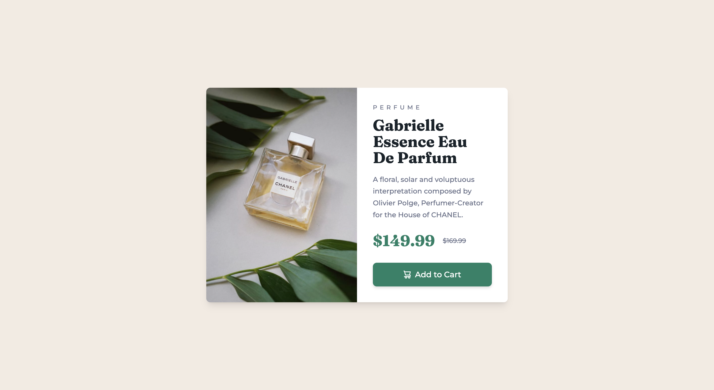

# Frontend Mentor - Product preview card component solution

This is a solution to the [Product preview card component challenge on Frontend Mentor](https://www.frontendmentor.io/challenges/product-preview-card-component-GO7UmttRfa). Frontend Mentor challenges help you improve your coding skills by building realistic projects.

## Table of contents

- [Overview](#overview)
  - [The challenge](#the-challenge)
  - [Screenshot](#screenshot)
  - [Links](#links)
- [My process](#my-process)
  - [Built with](#built-with)
  - [Reflection](#reflection)
  - [Useful resources](#useful-resources)
- [Author](#author)

## Overview

### The challenge

Users should be able to:

- View the optimal layout depending on their device's screen size
- See hover and focus states for interactive elements

### Screenshot

Desktop:

Mobile:

### Links

- Live Site URL: [Add live site URL here](https://spark-gabriell-perfume-preview-card.netlify.app/)

## My process

### Built with

- Semantic HTML5 markup
- CSS custom properties
- Flexbox
- CSS Grid
- Mobile-first workflow
- [Tailwind CSS](https://tailwindcss.com/)

### Reflection

This is my first project using Tailwind CSS. I relied on the official Tailwind CSS Doc to build it. It was fascinating to not have to come up with a class name for each element. I was also able to use the tailwing config file to add customized class names with values I needed. I would love to use Tailwind CSS more on my next projects!

### Useful resources

- [Tailwind CSS Docs](https://tailwindcss.com/docs/utility-first) - Official Tailwind CSS Docs.
- [Web Dev Simplified on Learning Tailwind CSS](https://www.youtube.com/watch?v=Ksn1tThNTjI) - This video by Web Dev Simplified encouraged me to try Tailwind CSS just using my CSS knowledge and Tailwind CSS Docs.

## Author

- Twitter - [@codingsooj](https://www.twitter.com/codingsooj)
